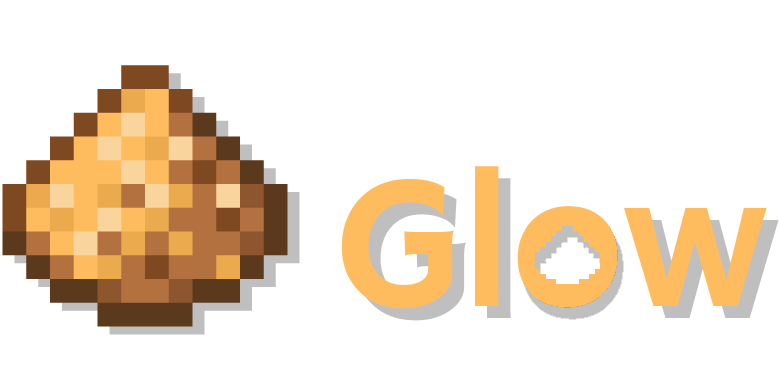

<h1 align="center">
  <b>GlowLang</b>
</h1>

<h3 align="center">
    Basic-ка подобный, интерпретируемый язык на Python
</h3>

<p align="center">
    <a href="https://github.com/keeniGithub/GlowLang/discussions">Discussions</a>
</p>

<br>

<h1 align="center">
  Использования
</h1>

> Для использования требуется устанровленный [Python](https://www.python.org/downloads/)

> Рекомендуемая версии >= 3.11

### Установка

Скопируйте данный репозиторий в нужную вам директорию и создайте в ней файл с расширением `.gl`

```basic
git clone https://github.com/keeniGithub/GlowLang.git
```

### Запуск

Для запуска вы можете использовать интерактивную консоль, запустив файл `shell.bat` или `shell.py` и выполнять код в ней

**Пример:**

```basic
GlowShell >>> print("hello world!")
hello world!
GlowShell >>>
```

#### Или

В этой же консоли вызвать функцию `run("filename.gl")`, передава в нее названия к файлу (учитывайте, что нужно указывать полный путь)

**Пример:**

```basic
GlowShell >>> run("example.gl")
>>> 5
120
GlowShell >>>
```

<h1 align="center">
  Документация
</h1>

<h2 align="center">
  Переменные
</h2>

Для создания перменных используеться ключевое слово `var`

Доступны типы данных:

- Целые числа
- Числа с плавующей точкой
- Строки
- Массивы (листы)

Так же можно использовать математические операторы

- `+` Плюс
- `-` Минус
- `*` Умножения
- `/` Деления
- `^` Степень

**Пример:**

```basic
var a = 1
var b = 25.07
var c = "Hello, Glow!"
var d = [1, 2, 3, "Four"]
var e = (2 + 2) * 2
```

Так же, в языке присутствует уже встроенные числовые значения

`null` - 0

`false` - 0

`true` - 1

`pi` - 3.141592653589793

`e` - 2.718281828459045

<h2 align="center">
  Циклы
</h2>

Glow использует конструкцию to then end как в Basic

## Цикл For

**Пример:**

```basic
for i = 0 to 5 then
    print(i)
end
```

Вывод:

```basic
0
1
2
3
4
```

## Цикл While

**Пример:**

```basic
var i = 0

while i < 5 then
    var i = i+1
    print(i)
end
```

Вывод:

```basic
1
2
3
4
5
```

<h2 align="center">
  Условия
</h2>

Как в любом языке, тут есть условия if, elif, else

Для них используються операторы сравнения:

- `>` Больше
- `>=` Больше или равно
- `<` Меньше
- `<=` меньше или равно
- `==` Равенства
- `!=` Неравенства

И логические операторы:

- `and` И
- `or` Или
- `not` Не

**Пример:**

```basic
var i = 101

if i == 100 then
    print("i is 100")
elif i == 101 then
    print("i is 101")
else
    print("i not 100 and not 101")
end
```

Вывод:

```basic
i is 101
```

<h2 align="center">
  Функции
</h2>

Функции создаються при помощи ключевого слова `func`
В круглых скобках вы передаете параметры, а аргументы при вызове (как вы любом другом языке)

**Пример:**

```basic
// Пример из example.gl

func factorial(n)
    var fctrl = 1
    while n > 1 then
        var fctrl = fctrl*n
        var n = n-1
    end

    return fctrl
end

var n = input_int()

print(factorial(n))
```

Вывод:

```basic
>>> 5
120
```

## Стрелочные функции

Стрелочные функции в Glow немного схожи с их аналогом в JavaScript или lambda в Python и Ruby, и нужны чтобы не писать много строк кода для простых действий

**Пример:**

```basic
func sum(a, b) -> a+b
print(sum(2, 2))
```

Вывод:

```basic
4
```

<h2 align="center">
  Встроенные функции
</h2>

- `print` - Выводит текст в консоль
- `input` - Принимает значения
- `input_int` - Принимает целые числа
- `is_number` - Является ли передаваемый аргумент числом
- `is_string` - Является ли передаваемый аргумент строкой
- `is_list` - Является ли передаваемый аргумент списком
- `is_function` - Является ли передаваемый аргумент функцией
- `append` - Добавляет новый элемент в конец списка
- `pop` - Удаляет элемент по указаному индексу
- `len` - Считает кол-во элемнтов в списке
- `clear` или `cls` - Очищает консоль
- `run` - Запускает скрипт

<h2 align="center">
  Операторы перехода
</h2>

Операторы перехода используются для изменения потока выполнения программы

- `break` - Прерывает выполнение текущего цикла
- `continue` - Завершает текущую итерацию цикла и переходит к следующей
- `return` - Возравщает указанное слово

**Пример:**

```basic
// Пример с return

func return_func(a)
    print("return_func")
    return a
end

print(return_func(3))
```

Вывод:

```basic
return_func
3
```

<br>
<br>
<br>

```basic
// Пример с break

func break_func()
    for i = 0 to 3 then
        if i == 2 then
            break
        else
            print(i)
        end

    end

    print("break_func")
end

break_func()
```

Вывод:

```basic
0
1
break_func
```

<br>
<br>
<br>

```basic
// Пример с continue

func continue_func()
    for i = 0 to 3 then
        if i == 2 then
            continue
        end
        print("continue_func")
    end
end

continue_func()
```

Вывод:

```basic
continue_func
continue_func
```

<h2 align="center">
  Коментарии
</h2>

Для коментариев используеться `//`

```
// Это коментарий
```
